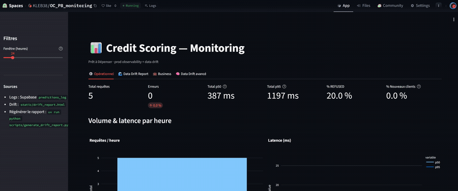

Hello Friend 👋

Welcome on my Github profile!

J'ai passé 10 ans en Testing, Inspection & Certification — laboratoires de biens industriels et de consommation, normes produit, direction d'équipe. J'y ai été le client de projets data : j'ai spécifié un LIMS, encadré son déploiement, et attendu des résultats de systèmes que d'autres construisaient. Je me suis reconverti pour être celui qui les construit.

Ce qui m'occupe aujourd'hui : le moment où un modèle cesse d'être un notebook et devient un service qu'on peut servir, mesurer et corriger. *Un modèle qui répond n'est pas un modèle qui a raison* : c'est la ligne qui sépare mes premiers projets des derniers.

**Ce que je cherche :** un poste de ML/AI Engineer.

---

### Ce que je sais faire, et où le vérifier

| Projet | Ce qu'il démontre | |
|---|---|---|
| **Credit Scoring API** | Mise en production complète — FastAPI, ONNX Runtime, CI/CD GitHub Actions, espace de monitoring dédié | [repo](https://github.com/KL38/OC_P8_MLOPS_Credit-scoring-API) · [démo](https://huggingface.co/spaces/KLEB38/OC_P8) |
| **NBA Analyst AI** | Évaluation d'un système RAG — fidélité ×2.5, précision du contexte ×4.3, mesurées sur 60 questions métier | [repo](https://github.com/KL38/OC_P10_RAG_NBA-comments-and-stats) |
| **Agritech** | Chaîne complète modèle → API → interface, avec un protocole de validation qui refuse le score flatteur | [repo](https://github.com/KL38/OC_P12_ML_MLOPS_Predict-Crops-rentability) |
| **Brain Tumor Detection** | Deep Learning semi-supervisé — 1 406 IRM pseudo-labellisées par clustering, un CNN qui bat le supervisé pur avec 100 images annotées | [repo](https://github.com/KL38/OC_P7_DL_SSL_Brain-Tumor-Detection) |
| **Credit Scoring** | ML piloté par le coût métier — `10×FN + FP` décide de la métrique et du seuil, pas l'inverse | [repo](https://github.com/KL38/OC_P6_ML_Predict-Credit-Scoring) |
| **Assistant culturel RAG** | RAG de bout en bout sur corpus réel, évalué avec Ragas | [repo](https://github.com/KL38/OC_P9_RAG_Cultural-event-chatbot) |

---

### Comment je travaille

**Je mesure avant d'optimiser.** Sur le RAG NBA, j'ai d'abord construit, puis diagnostiqué : l'erreur venait du retrieval, pas du modèle. Depuis, le harnais d'évaluation vient en premier.

**J'audite la donnée avant de modéliser.** Sur le projet Agritech, le jeu de données fourni était entièrement synthétique — j'en ai reconstitué la formule génératrice pour le démontrer, puis j'ai changé de jeu plutôt que de livrer un moteur de recommandation sans fondement.

**Je préfère le chiffre vrai au chiffre flatteur.** Validation groupée par pays et test sur 22 pays jamais vus, au lieu d'un découpage aléatoire qui aurait gonflé le score en laissant fuiter la signature du pays.

**Je livre du code, pas des notebooks.** `src/`, tests, CI, Docker. Mes premiers projets sont des notebooks et je les laisse en ligne — la progression fait partie du dossier.

---

### Stack

`Python` · `scikit-learn` · `PyTorch` · `FastAPI` · `Docker` · `MLflow` · `GitHub Actions` · `LangChain` / `Pydantic AI` · `FAISS` · `RAGAS` · `Streamlit` · `uv`

En cours d'approfondissement : Deep Learning & Computer Vision, orchestration (Airflow, Kubernetes), cloud à l'échelle.

### Parcours

Diplôme Data Scientist & Machine Learning (eq. M.Sc.) — OpenClassrooms, 2026

Master MAE / MBA — IAE Toulouse · Ingénieur Matériaux — Polytech Montpellier

Français natif · Anglais courant (4 ans à Hong Kong) · Allemand B1

---

### Aperçus

**Credit Scoring API — espace de monitoring.** Volumétrie, latence p50/p95 décomposée par étape, dérive des features et suivi des décisions.

<!-- Liens en attente : le CV et le rapport de conduite de projet n'ont pas encore
     d'URL publique. Rétablir cette ligne quand ce sera le cas.
📄 [CV](LIEN_CV) · 📊 [Rapport de conduite de projet data](LIEN_RAPPORT)
-->
